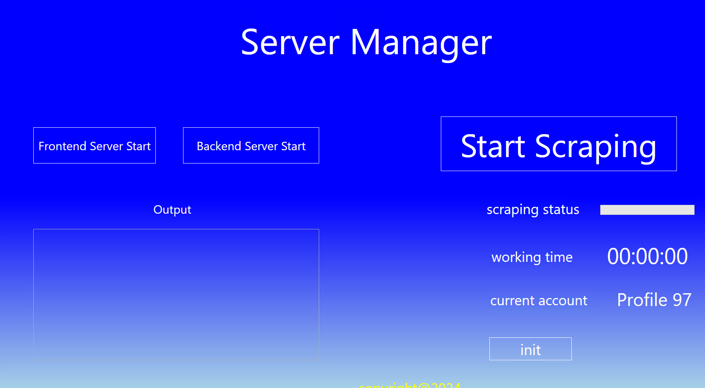

# Server Manager and Chrome Controller 

## About program

This is auto controller for chrome browser.

This is used to auto open and close 144 profiles to web scrapping.

##  main interface

### How to run?
- when click <button style = "color: white; background:transparent">Frontend Server Start</button>, then run Frontend server.

- when click <button style = "color: white; background:transparent">Backend Server Start</button>, then run Backend server.

- when click <button style = "color: white; background:transparent">Start Scrapping </button>, then start web scrapping.
- when click <button style = "color: white; background:transparent">init </button>, then initialize, and start with 0 profile.

Every profile runs until 20 minutes, and after 20 minutes, auto close and open new profile automatically.

